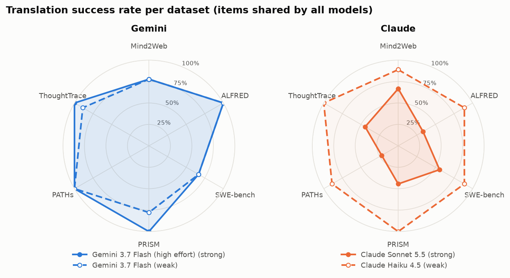
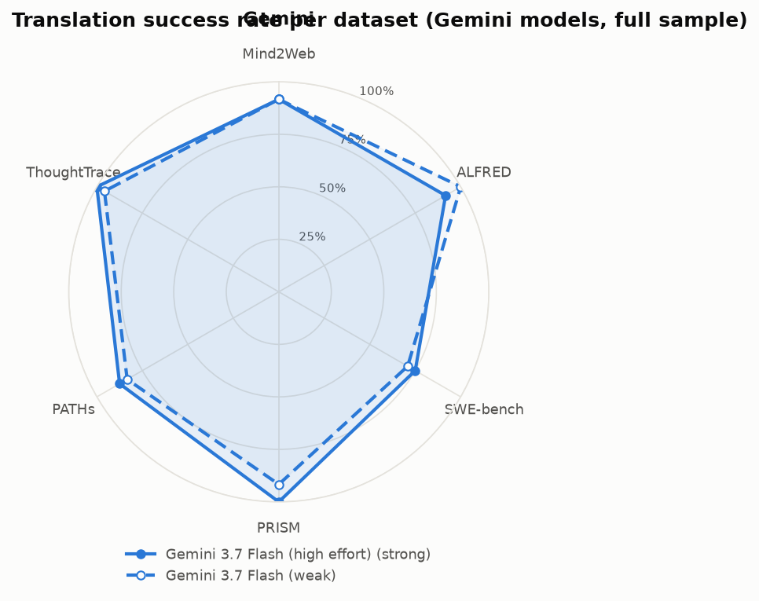
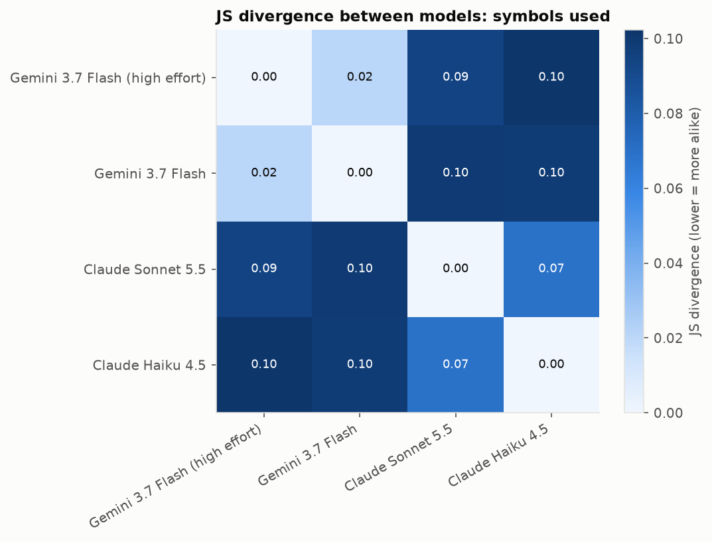
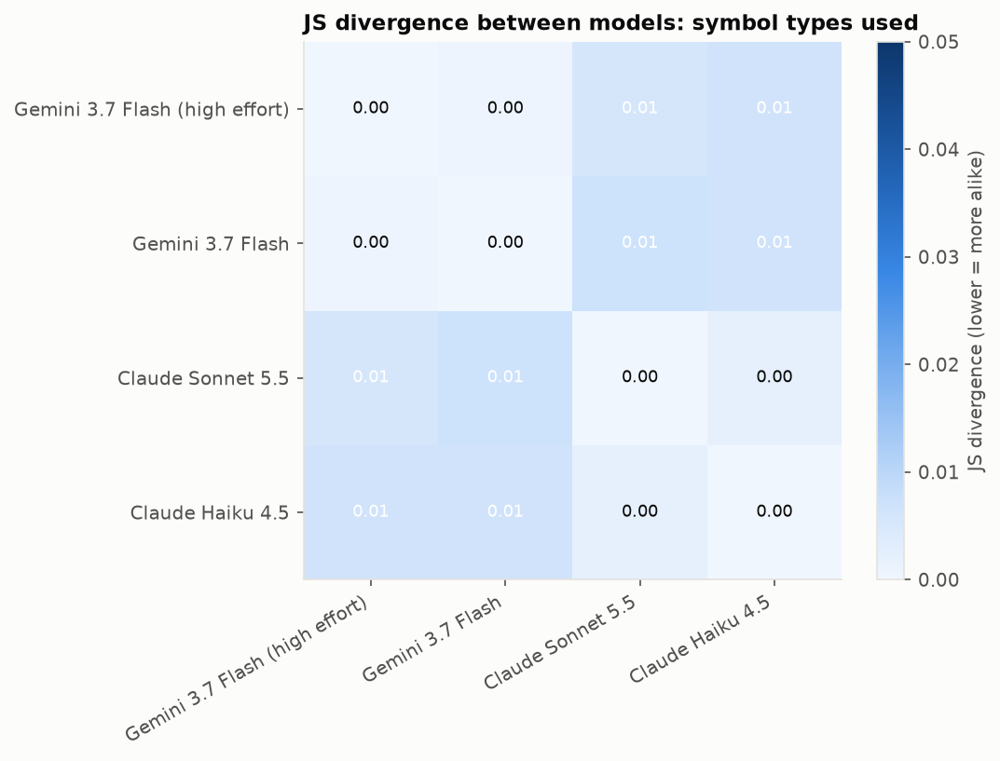
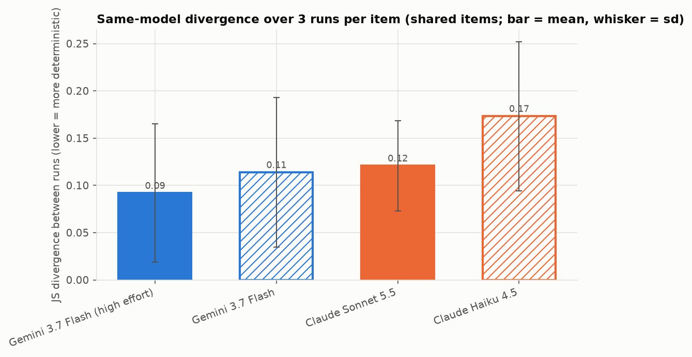
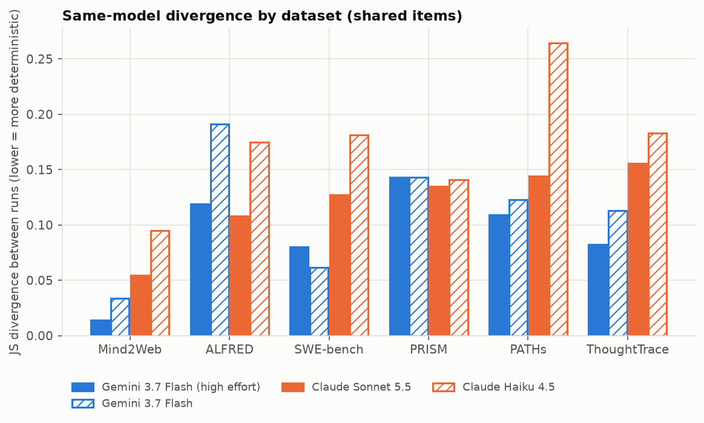
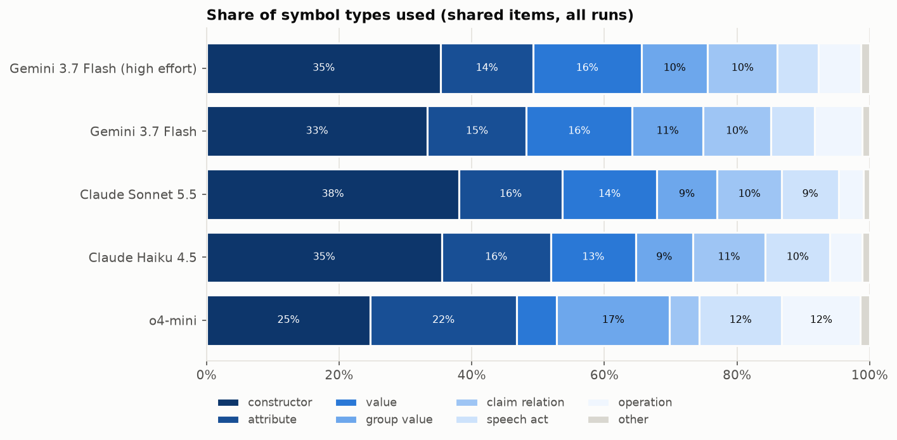
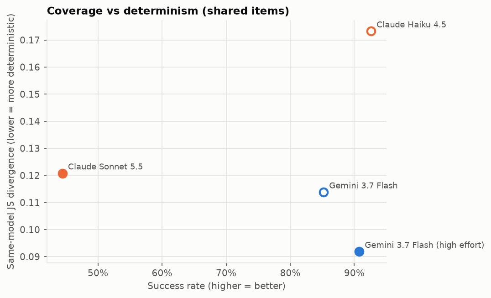
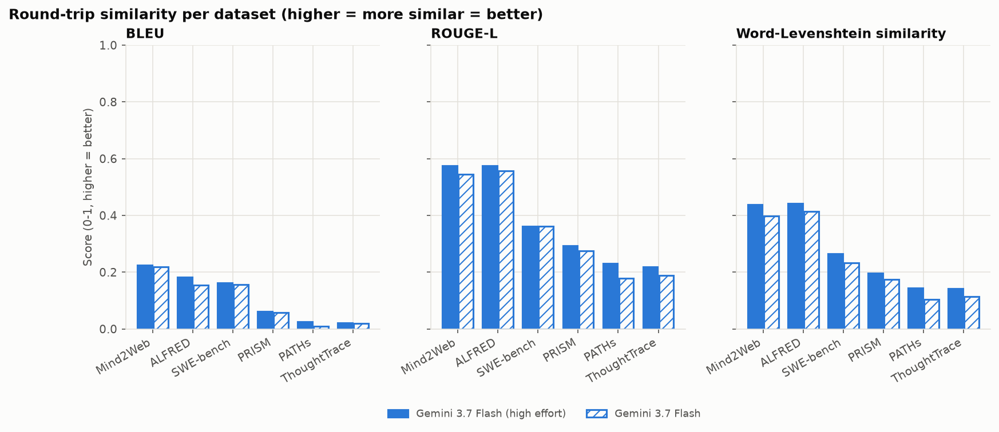

## Overview

Unseen test items were translated into BrainCode (spec 19.0.0-draft.2-lexical-groups, glossary g19) with the swarm translator setup: compact spec, glossary RAG, pi harness in Docker. Gemini models translated 48 items (8 per dataset, stratified, at most 6,000 characters) three times each. The other models translated the 18 items shared with Gemini (3 per dataset), three times each. GPT-6.1 Sol and GPT-6 Luna were stopped part-way (0 successes) and are left out of this report. Expressivity (back-translation) covers the Gemini models and o4-mini: the back-translator sees only the BrainCode, and the scores compare the original item text with the reconstructed text only.

Translations that carry natural language instead of encoding it (claimed successes with needs marked opaque, or any translation with a quoted string of 8+ words outside names/titles; spec §13) are counted as errors and left out of the determinism, expressivity and qualitative analyses. o4-mini, where this happened 3 times, translated those 3 items again with the corrected success check; like the other models it has 3 runs per shared item (54), 3 of them the rejected ones. Expressivity uses one back-translation per model and item (its first usable run).

| company | model | tier |
|---|---|---|
| Gemini | Gemini 3.7 Flash (high effort) | strong |
| Gemini | Gemini 3.7 Flash | weak |
| Claude | Claude Sonnet 5.5 | strong |
| Claude | Claude Haiku 4.5 | weak |
| OpenAI | o4-mini | weak |

## Coverage

Success rate (higher is better) and mean number of missing glossary symbols per failed translation (the distinct symbols its suggestions add). `shared` = the items every model translated; `all` = the full sample (Gemini models).

`rejected` = claimed successes and declared failures counted as errors because they carry source text instead of encoding it (needs marked opaque, or quoted strings of 8+ words outside names/titles; spec §13). They are included in `error` and left out of the determinism and expressivity analyses.

| company | model | tier | items | runs | success | failed | error | rejected | missing symbols / failed | min / run | cost $ |
|---|---|---|---|---:|---:|---:|---:|---:|---:|---:|---:|
| Gemini | Gemini 3.7 Flash (high effort) | strong | shared | 54 | 0.91 | 0.04 | 0.06 | 3 | 1.0 | 21.7 | 24.76 |
| Gemini | Gemini 3.7 Flash (high effort) | strong | all | 144 | 0.91 | 0.04 | 0.05 | 7 | 1.7 | 22.2 | 65.76 |
| Gemini | Gemini 3.7 Flash | weak | shared | 54 | 0.85 | 0.07 | 0.07 | 4 | 1.8 | 9.2 | 14.61 |
| Gemini | Gemini 3.7 Flash | weak | all | 144 | 0.89 | 0.06 | 0.05 | 7 | 2.1 | 9.8 | 41.02 |
| Claude | Claude Sonnet 5.5 | strong | shared | 54 | 0.44 | 0.56 | 0.00 | 0 | 1.8 | 2.8 | 11.06 |
| Claude | Claude Haiku 4.5 | weak | shared | 54 | 0.93 | 0.07 | 0.00 | 0 | 2.5 | 6.3 | 16.45 |
| OpenAI | o4-mini | weak | shared | 54 | 0.07 | 0.85 | 0.07 | 0 | 2.4 | 4.6 | 6.18 |

Success rate per dataset:

| model | items | Mind2Web | ALFRED | SWE-bench | PRISM | PATHs | ThoughtTrace |
|---|---|---:|---:|---:|---:|---:|---:|
| Gemini 3.7 Flash (high effort) | shared | 0.78 | 1.00 | 0.67 | 1.00 | 1.00 | 1.00 |
| Gemini 3.7 Flash (high effort) | all | 0.92 | 0.92 | 0.75 | 1.00 | 0.88 | 1.00 |
| Gemini 3.7 Flash | shared | 0.78 | 1.00 | 0.67 | 0.78 | 1.00 | 0.89 |
| Gemini 3.7 Flash | all | 0.92 | 1.00 | 0.71 | 0.92 | 0.83 | 0.96 |
| Claude Sonnet 5.5 | shared | 0.67 | 0.33 | 0.56 | 0.44 | 0.22 | 0.44 |
| Claude Haiku 4.5 | shared | 0.89 | 0.89 | 0.89 | 1.00 | 0.89 | 1.00 |
| o4-mini | shared | 0.11 | 0.11 | 0.11 | 0.00 | 0.11 | 0.00 |

{width=16cm}

{width=16cm}

## Determinism

Jensen-Shannon divergence (base 2, 0 = identical symbol use, 1 = disjoint; lower = more alike) between the symbol distributions P(symbol | model) and P(symbol type | model), pooled over every translation of the shared items. Same-model divergence: for each item, the mean JS over its pairs of runs; then the mean over items.

### Model pairs

| pair | model A | model B | JS symbols | JS types |
|---|---|---|---:|---:|
| strong vs strong, different companies | Gemini 3.7 Flash (high effort) | Claude Sonnet 5.5 | 0.094 | 0.006 |
| weak vs strong, same company | Gemini 3.7 Flash (high effort) | Gemini 3.7 Flash | 0.020 | 0.001 |
| weak vs strong, same company | Claude Sonnet 5.5 | Claude Haiku 4.5 | 0.069 | 0.002 |
| weak vs weak, different companies | Gemini 3.7 Flash | Claude Haiku 4.5 | 0.098 | 0.007 |
| weak vs weak, different companies | Gemini 3.7 Flash | o4-mini | 0.183 | 0.050 |
| weak vs weak, different companies | Claude Haiku 4.5 | o4-mini | 0.165 | 0.051 |

### Same model, repeated runs

| model | items | items with ≥2 runs | JS symbols (mean ± sd) | JS types | identical run pairs |
|---|---|---:|---:|---:|---:|
| Gemini 3.7 Flash (high effort) | shared | 17 | 0.092 ± 0.073 | 0.025 | 0.08 |
| Gemini 3.7 Flash (high effort) | all | 46 | 0.114 ± 0.078 | 0.032 | 0.04 |
| Gemini 3.7 Flash | shared | 17 | 0.114 ± 0.079 | 0.034 | 0.00 |
| Gemini 3.7 Flash | all | 46 | 0.135 ± 0.090 | 0.046 | 0.04 |
| Claude Sonnet 5.5 | shared | 18 | 0.121 ± 0.048 | 0.034 | 0.02 |
| Claude Haiku 4.5 | shared | 18 | 0.173 ± 0.079 | 0.049 | 0.02 |
| o4-mini | shared | 16 | 0.330 ± 0.163 | 0.162 | 0.00 |

{width=16cm}

{width=16cm}

{width=16cm}

{width=16cm}

{width=16cm}

{width=16cm}

## Expressivity

**Every score is in [0, 1] and higher = input and output more similar = better.** BLEU = mean sentence BLEU (and corpus BLEU); ROUGE-L = longest-common-subsequence F1; word-Levenshtein similarity = 1 − word edit distance / longer length. One forward translation per item (its first usable run) is back-translated by the same model without seeing the original: the back-translator gets only the BrainCode block of the translation (not the translation report), and the scores compare only the original item text (input) with the reconstructed text (output), turn markers removed.

`items`: `all` = the model's full sample (Gemini: 48 items); `shared` = the 18 items every model translated (use these rows to compare models; o4-mini has back-translations only where its forward run produced a usable translation). Per-dataset rows and the figure use each model's full sample.

`quoted` = share of the BrainCode's characters inside quoted string literals (`content="…"` and other literals). Text carried verbatim in strings comes back almost unchanged, so a high score with a high quoted share measures copying, not how much meaning the symbols encode.

| model | items | dataset | pairs | BLEU ↑ | corpus BLEU ↑ | ROUGE-L ↑ | word-Levenshtein similarity ↑ | quoted |
|---|---|---|---:|---:|---:|---:|---:|---:|
| Gemini 3.7 Flash (high effort) | shared | all | 17 | 0.129 | 0.038 | 0.384 | 0.282 | 0.11 |
| Gemini 3.7 Flash | shared | all | 17 | 0.112 | 0.029 | 0.354 | 0.246 | 0.12 |
| o4-mini | shared | all | 7 | 0.082 | 0.002 | 0.267 | 0.170 | 0.08 |
| Gemini 3.7 Flash (high effort) | all | all | 46 | 0.114 | 0.041 | 0.380 | 0.275 | 0.10 |
| Gemini 3.7 Flash | all | all | 46 | 0.103 | 0.034 | 0.355 | 0.242 | 0.11 |
| o4-mini | shared | Mind2Web | 1 | 0.017 | 0.017 | 0.295 | 0.191 | 0.12 |
| o4-mini | shared | ALFRED | 1 | 0.360 | 0.360 | 0.677 | 0.478 | 0.08 |
| o4-mini | shared | SWE-bench | 1 | 0.194 | 0.194 | 0.421 | 0.269 | 0.09 |
| o4-mini | shared | PRISM | 3 | 0.001 | 0.000 | 0.110 | 0.058 | 0.05 |
| o4-mini | shared | ThoughtTrace | 1 | 0.000 | 0.000 | 0.146 | 0.075 | 0.15 |
| Gemini 3.7 Flash (high effort) | all | Mind2Web | 8 | 0.225 | 0.245 | 0.576 | 0.438 | 0.13 |
| Gemini 3.7 Flash (high effort) | all | ALFRED | 8 | 0.182 | 0.210 | 0.575 | 0.442 | 0.04 |
| Gemini 3.7 Flash (high effort) | all | SWE-bench | 7 | 0.163 | 0.110 | 0.362 | 0.266 | 0.14 |
| Gemini 3.7 Flash (high effort) | all | PRISM | 8 | 0.062 | 0.055 | 0.294 | 0.197 | 0.12 |
| Gemini 3.7 Flash (high effort) | all | PATHs | 7 | 0.026 | 0.014 | 0.231 | 0.145 | 0.12 |
| Gemini 3.7 Flash (high effort) | all | ThoughtTrace | 8 | 0.021 | 0.008 | 0.219 | 0.143 | 0.09 |
| Gemini 3.7 Flash | all | Mind2Web | 8 | 0.218 | 0.233 | 0.544 | 0.397 | 0.14 |
| Gemini 3.7 Flash | all | ALFRED | 8 | 0.155 | 0.181 | 0.557 | 0.414 | 0.03 |
| Gemini 3.7 Flash | all | SWE-bench | 7 | 0.156 | 0.085 | 0.361 | 0.233 | 0.16 |
| Gemini 3.7 Flash | all | PRISM | 8 | 0.058 | 0.059 | 0.275 | 0.174 | 0.14 |
| Gemini 3.7 Flash | all | PATHs | 7 | 0.010 | 0.007 | 0.179 | 0.104 | 0.12 |
| Gemini 3.7 Flash | all | ThoughtTrace | 8 | 0.020 | 0.006 | 0.190 | 0.113 | 0.09 |

{width=16cm}

## Expressivity: types of input-output differences

Measured on every scored round trip (original item text vs the reconstruction written from the BrainCode alone). Shares are the fraction of pairs; `lost` columns are the mean share of the original's numbers / capitalised names / code-like identifiers missing from the reconstruction; `added words` is the share of reconstruction words that never occur in the original. `language switch` = original mostly non-English, reconstruction English. `turns differ` = number of user/assistant turns differs; `steps differ` = numbered/bulleted steps differ by 2 or more.

### Per model (each model's full sample)

| model | pairs | ROUGE-L | length ratio | compressed (<0.6) | expanded (>1.4) | language switch | turns differ | steps differ | numbers lost | names lost | identifiers lost | added words |
|---|---:|---:|---:|---:|---:|---:|---:|---:|---:|---:|---:|---:|
| Gemini 3.7 Flash | 46 | 0.355 | 0.58 | 0.65 | 0.02 | 0.09 | 0.13 | 0.57 | 0.67 | 0.46 | 0.69 | 0.21 |
| Gemini 3.7 Flash (high effort) | 46 | 0.380 | 0.67 | 0.54 | 0.04 | 0.07 | 0.13 | 0.50 | 0.53 | 0.43 | 0.69 | 0.22 |
| o4-mini | 7 | 0.267 | 0.36 | 0.71 | 0.00 | 0.14 | 0.29 | 0.71 | 0.90 | 0.73 | 0.50 | 0.26 |

### Per model (the 18 shared items only)

| model | pairs | ROUGE-L | length ratio | compressed (<0.6) | expanded (>1.4) | language switch | turns differ | steps differ | numbers lost | names lost | identifiers lost | added words |
|---|---:|---:|---:|---:|---:|---:|---:|---:|---:|---:|---:|---:|
| Gemini 3.7 Flash | 17 | 0.354 | 0.56 | 0.71 | 0.06 | 0.18 | 0.18 | 0.65 | 0.64 | 0.41 | 0.74 | 0.22 |
| Gemini 3.7 Flash (high effort) | 17 | 0.384 | 0.60 | 0.53 | 0.00 | 0.12 | 0.18 | 0.59 | 0.56 | 0.42 | 0.73 | 0.23 |
| o4-mini | 7 | 0.267 | 0.36 | 0.71 | 0.00 | 0.14 | 0.29 | 0.71 | 0.90 | 0.73 | 0.50 | 0.26 |

### Per dataset (all models)

| dataset | pairs | ROUGE-L | length ratio | compressed (<0.6) | expanded (>1.4) | language switch | turns differ | steps differ | numbers lost | names lost | identifiers lost | added words |
|---|---:|---:|---:|---:|---:|---:|---:|---:|---:|---:|---:|---:|
| Mind2Web | 17 | 0.544 | 0.85 | 0.18 | 0.00 | 0.35 | 0.00 | 0.29 | 0.32 | 0.11 | — | 0.12 |
| ALFRED | 17 | 0.572 | 0.74 | 0.29 | 0.06 | 0.00 | 0.76 | 1.00 | 0.94 | 0.73 | — | 0.10 |
| SWE-bench | 15 | 0.366 | 0.94 | 0.47 | 0.13 | 0.00 | 0.00 | 0.60 | 0.59 | 0.41 | 0.31 | 0.33 |
| PRISM | 19 | 0.257 | 0.45 | 0.84 | 0.00 | 0.00 | 0.05 | 0.26 | 0.54 | 0.50 | — | 0.25 |
| PATHs | 14 | 0.205 | 0.31 | 0.93 | 0.00 | 0.00 | 0.00 | 0.14 | 0.46 | 0.39 | 1.00 | 0.24 |
| ThoughtTrace | 17 | 0.201 | 0.33 | 0.94 | 0.00 | 0.12 | 0.00 | 0.94 | 0.78 | 0.69 | 1.00 | 0.29 |

## Failed translations

Every failed run, with the terms its translator documented as missing from the glossary (`add`) or needing a change (`refine`), from its suggestions.

| model | item | run | adds | terms it would add | refines | targets |
|---|---|---:|---:|---|---:|---|
| Claude Haiku 4.5 | alfred-1 | r1 | 2 | spatial_relation, object_descriptor | 2 | v19/value/ottoman, v19/value/couch |
| Claude Haiku 4.5 | mind2web-1 | r2 | 4 | trip_type_spec, nonstop_constraint, airline_selected, flight_selected | 0 | — |
| Claude Haiku 4.5 | paths-1 | r3 | 1 | tone_flirty | 0 | — |
| Claude Haiku 4.5 | swebench-3 | r3 | 3 | code_file_operation, package_installation, not_reproducible | 0 | — |
| Claude Sonnet 5.5 | alfred-1 | r1 | 2 | entity_description, spatial_relation | 0 | — |
| Claude Sonnet 5.5 | alfred-1 | r2 | 2 | located, described_object | 1 | v19/support/activity |
| Claude Sonnet 5.5 | alfred-1 | r3 | 2 | spatial_relation, described_entity | 0 | — |
| Claude Sonnet 5.5 | alfred-2 | r3 | 2 | entity_description, step | 0 | — |
| Claude Sonnet 5.5 | alfred-3 | r1 | 1 | spatial_relation | 2 | v19/constructor/activity, v19/constructor/requirement |
| Claude Sonnet 5.5 | alfred-3 | r3 | 1 | spatial_relation | 0 | — |
| Claude Sonnet 5.5 | mind2web-3 | r1 | 1 | unit_watt | 0 | — |
| Claude Sonnet 5.5 | mind2web-3 | r2 | 1 | unit_watt | 0 | — |
| Claude Sonnet 5.5 | mind2web-3 | r3 | 1 | unit_watt | 0 | — |
| Claude Sonnet 5.5 | paths-1 | r1 | 2 | persona, tone_flirty | 0 | — |
| Claude Sonnet 5.5 | paths-1 | r3 | 2 | tone_flirty, persona | 0 | — |
| Claude Sonnet 5.5 | paths-2 | r1 | 3 | reconcile_accounts, property_question, possible | 0 | — |
| Claude Sonnet 5.5 | paths-2 | r3 | 3 | reconcile, meaning_question, recurrence | 0 | — |
| Claude Sonnet 5.5 | paths-3 | r1 | 2 | adaptation, depicts | 0 | — |
| Claude Sonnet 5.5 | paths-3 | r2 | 1 | depicts | 1 | art_story |
| Claude Sonnet 5.5 | paths-3 | r3 | 3 | request, story_contains, adaptation_of | 0 | — |
| Claude Sonnet 5.5 | prism-1 | r3 | 2 | occurs, yes_no_question | 0 | — |
| Claude Sonnet 5.5 | prism-2 | r1 | 4 | precedes, fraction, alternatives, feasibility | 0 | — |
| Claude Sonnet 5.5 | prism-2 | r2 | 4 | requires, precedes, alternative, suitable_for | 0 | — |
| Claude Sonnet 5.5 | prism-3 | r1 | 1 | why_question | 0 | — |
| Claude Sonnet 5.5 | prism-3 | r3 | 1 | open_question | 0 | — |
| Claude Sonnet 5.5 | swebench-1 | r2 | 1 | disjunction | 0 | — |
| Claude Sonnet 5.5 | swebench-1 | r3 | 4 | variable_unassigned, reads_variable, lacks_statement, alternatives | 0 | — |
| Claude Sonnet 5.5 | swebench-2 | r3 | 0 | — | 1 | v19/constructor/chg_modify_code |
| Claude Sonnet 5.5 | swebench-3 | r2 | 1 | propose | 0 | — |
| Claude Sonnet 5.5 | thoughttrace-2 | r1 | 3 | property_question, desires, has_property | 0 | — |
| Claude Sonnet 5.5 | thoughttrace-2 | r3 | 1 | desires | 0 | — |
| Claude Sonnet 5.5 | thoughttrace-3 | r1 | 1 | fails_to | 0 | — |
| Claude Sonnet 5.5 | thoughttrace-3 | r2 | 1 | unable_to_complete | 0 | — |
| Claude Sonnet 5.5 | thoughttrace-3 | r3 | 1 | unable_to | 0 | — |
| Gemini 3.7 Flash | mind2web-3 | r2 | 1 | unit_watt | 0 | — |
| Gemini 3.7 Flash | mind2web-3 | r3 | 1 | unit_watt | 0 | — |
| Gemini 3.7 Flash | paths-8 | r3 | 3 | praise, thank, compliment | 0 | — |
| Gemini 3.7 Flash | prism-3 | r2 | 2 | national_id, verification_requirement | 0 | — |
| Gemini 3.7 Flash | prism-3 | r3 | 3 | identity_credential, account_verification, multi_factor_authentication | 0 | — |
| Gemini 3.7 Flash | swebench-4 | r1 | 2 | network_connection, hang | 1 | v19/operation-vocabulary/modify_code |
| Gemini 3.7 Flash | swebench-4 | r3 | 2 | network_connection, cli_flag | 0 | — |
| Gemini 3.7 Flash | swebench-6 | r2 | 1 | path_tools_py3tool_py | 0 | — |
| Gemini 3.7 Flash | swebench-7 | r3 | 4 | chg_deprecate_code, code_usage, code_breakage, code_evaluation | 0 | — |
| Gemini 3.7 Flash (high effort) | alfred-6 | r1 | 1 | inscribed_text | 0 | — |
| Gemini 3.7 Flash (high effort) | alfred-6 | r2 | 0 | — | 1 | v19/operation-vocabulary/pick_up |
| Gemini 3.7 Flash (high effort) | mind2web-3 | r1 | 1 | unit_watt | 0 | — |
| Gemini 3.7 Flash (high effort) | mind2web-3 | r3 | 1 | unit_watt | 0 | — |
| Gemini 3.7 Flash (high effort) | swebench-4 | r1 | 2 | connection, functions_properly | 0 | — |
| Gemini 3.7 Flash (high effort) | swebench-7 | r3 | 5 | chg_deprecate, code_usage, breakage, inconsistent_behavior, code_eval | 0 | — |
| o4-mini | alfred-1 | r1 | 2 | object_specification, path_specification | 0 | — |
| o4-mini | alfred-1 | r2 | 2 | furniture_label, colored_object | 0 | — |
| o4-mini | alfred-1 | r3 | 1 | object_description | 0 | — |
| o4-mini | alfred-2 | r1 | 2 | chill, object_at_location | 0 | — |
| o4-mini | alfred-2 | r2 | 1 | object_at_location | 0 | — |
| o4-mini | alfred-2 | r3 | 1 | chill | 0 | — |
| o4-mini | alfred-3 | r2 | 2 | entity_reference, requirement | 1 | v19/construction/activity |
| o4-mini | alfred-3 | r3 | 3 | command, walk_forward, select_object | 1 | pick_up |
| o4-mini | mind2web-1 | r1 | 1 | flight_search_request | 0 | — |
| o4-mini | mind2web-1 | r2 | 2 | flight_search, request | 0 | — |
| o4-mini | mind2web-1 | r3 | 1 | flight_search_request | 0 | — |
| o4-mini | mind2web-3 | r1 | 1 | search_request | 0 | — |
| o4-mini | mind2web-3 | r2 | 2 | power_unit_label, request_action | 1 | measure |
| o4-mini | mind2web-3 | r3 | 1 | unit_watt | 0 | — |
| o4-mini | paths-1 | r3 | 3 | tone_flirty, causal_question, availability_question | 0 | — |
| o4-mini | paths-2 | r1 | 2 | account_reconciliation, custom_report_request | 0 | — |
| o4-mini | paths-2 | r2 | 4 | reconcile_balance_sheet_accounts, explain_in_reporting, create_custom_report, schedule_recurring_report | 0 | — |
| o4-mini | paths-2 | r3 | 6 | definition, click_button, select_column, run_report, schedule_report, report_request | 0 | — |
| o4-mini | paths-3 | r1 | 3 | ask, provide, rewrite | 0 | — |
| o4-mini | paths-3 | r3 | 3 | plot_request, narrative_text, adaptation_request | 0 | — |
| o4-mini | prism-1 | r1 | 2 | problem_question, topic_personal_hobbies | 0 | — |
| o4-mini | prism-1 | r2 | 2 | work_life_balance, multiple_part_time_jobs | 0 | — |
| o4-mini | prism-1 | r3 | 4 | topic_work_personal_issues, policy_action, job_count, part_time | 1 | activity |
| o4-mini | prism-2 | r1 | 1 | inefficient | 0 | — |
| o4-mini | prism-2 | r2 | 8 | procedure_question, mower_blade_height, fractional_limit, straight_back_and_forth, sequence, possibility_question, limitation, equipment_requirement | 0 | — |
| o4-mini | prism-2 | r3 | 1 | procedure_question | 0 | — |
| o4-mini | prism-3 | r1 | 7 | reason_question, policy_document, mitigation_question, email_verification_term, requirement, two_factor_requirement, tradeoff_summary | 1 | v19/claim/enables |
| o4-mini | prism-3 | r2 | 1 | property_question | 0 | — |
| o4-mini | prism-3 | r3 | 2 | question_why, social_security_number | 0 | — |
| o4-mini | swebench-1 | r1 | 2 | assert_variable_assigned, assert_unpack_missing | 0 | — |
| o4-mini | swebench-1 | r2 | 4 | code_error_context, method_call, maintainers_list, instruct_modify_code | 0 | — |
| o4-mini | swebench-1 | r3 | 1 | code_revision | 0 | — |
| o4-mini | swebench-2 | r1 | 2 | implement_method, test_truthiness | 0 | — |
| o4-mini | swebench-2 | r2 | 1 | implement_method | 0 | — |
| o4-mini | swebench-3 | r1 | 2 | deprecation_notice, code_location | 0 | — |
| o4-mini | swebench-3 | r2 | 6 | create_file, execute_cli, deprecation_notice, originates_from, cannot_reproduce, catches_warning | 1 | v19/claim_relation/warning |
| o4-mini | swebench-3 | r3 | 1 | log_entry | 0 | — |
| o4-mini | thoughttrace-1 | r1 | 1 | story_planning_guide | 0 | — |
| o4-mini | thoughttrace-1 | r2 | 2 | classify, organization_framework | 0 | — |
| o4-mini | thoughttrace-1 | r3 | 4 | story_organization_framework, categorize_best_methods, story_genre, realize_vision | 0 | — |
| o4-mini | thoughttrace-2 | r1 | 2 | itinerary_summary, travel_intent | 0 | — |
| o4-mini | thoughttrace-2 | r2 | 2 | content_plan_trip, trip_details | 0 | — |
| o4-mini | thoughttrace-2 | r3 | 3 | role_parents, style_adventure, itinerary_plan | 0 | — |
| o4-mini | thoughttrace-3 | r1 | 1 | cannot_complete | 0 | — |
| o4-mini | thoughttrace-3 | r2 | 1 | failure_to_complete | 0 | — |
| o4-mini | thoughttrace-3 | r3 | 3 | cannot_complete, request_help, property_question | 0 | — |

### Most frequent missing terms per model

- **Claude Haiku 4.5**: spatial_relation (1), object_descriptor (1), trip_type_spec (1), nonstop_constraint (1), airline_selected (1), flight_selected (1), tone_flirty (1), code_file_operation (1), package_installation (1), not_reproducible (1)
- **Claude Sonnet 5.5**: spatial_relation (4), unit_watt (3), entity_description (2), persona (2), tone_flirty (2), property_question (2), depicts (2), precedes (2), alternatives (2), desires (2), located (1), described_object (1), described_entity (1), step (1), reconcile_accounts (1)
- **Gemini 3.7 Flash**: unit_watt (2), network_connection (2), praise (1), thank (1), compliment (1), national_id (1), verification_requirement (1), identity_credential (1), account_verification (1), multi_factor_authentication (1), hang (1), cli_flag (1), path_tools_py3tool_py (1), chg_deprecate_code (1), code_usage (1)
- **Gemini 3.7 Flash (high effort)**: unit_watt (2), inscribed_text (1), connection (1), functions_properly (1), chg_deprecate (1), code_usage (1), breakage (1), inconsistent_behavior (1), code_eval (1)
- **o4-mini**: chill (2), object_at_location (2), requirement (2), flight_search_request (2), procedure_question (2), property_question (2), implement_method (2), deprecation_notice (2), cannot_complete (2), object_specification (1), path_specification (1), furniture_label (1), colored_object (1), object_description (1), entity_reference (1)

## Qualitative analysis: determinism (JS divergence of symbol use)

Type shares below are my own computations from `type_counts`: count divided by that model's total typed symbols. Raw counts are not comparable across models because volume differs, especially for o4-mini. In every model, the `attribute` type count almost exactly equals the count of the symbol `target` (e.g. Gemini high 483/483, Sonnet 662/661, o4-mini 361/358). So "attribute" effectively measures use of the `target=` argument.

### 1. Constructs and symbol types that particular models over-use

**Type-level profile (share of typed symbols)**

| Type | Gemini high | Gemini Flash | Sonnet 5.5 | Haiku 4.5 | o4-mini |
|---|---|---|---|---|---|
| constructor | 35.4% | 33.3% | **38.1%** | 35.5% | 24.7% |
| value | **16.4%** | 15.9% | 14.3% | 12.8% | 6.1% |
| attribute (`target`) | 13.9% | 14.9% | 15.5% | 16.4% | **22.0%** |
| claim_relation | 10.5% | 10.2% | 9.8% | 11.0% | **4.4%** |
| group_value | 10.0% | 10.7% | 9.1% | 8.6% | **17.0%** |
| speech_act | 6.2% | 6.6% | 8.5% | 9.7% | **12.5%** |
| operation | 6.4% | 7.2% | 3.8% | 4.8% | **11.8%** |

**The four strong-performing models share one type profile.**
- Type-level JS among the two Gemini and two Claude models is tiny, between 0.0007 and 0.007.
- o4-mini is the clear outlier. Its JS against every other model is 0.050–0.062.
- o4-mini's profile has:
  - half the constructor-heavy content of the others;
  - less than half their claim relations;
  - much more of the "thin" types: `target`, speech acts, operations and group values.

**Statement heads (per translation) show stable company signatures.**

- **Gemini uses ACTION more.**
  - Gemini models use about 2.6 `ACTION` per translation (2.64 / 2.57).
  - Claude uses 0.74 (Haiku) and 1.3 (Sonnet).
  - Gemini also uses `TASK` blocks (0.16–0.18), which Haiku never does and Sonnet almost never does (0.02).
  - The alfred example shows the cause. Gemini high switches to `MODE REQUEST … TASK Keys { ACTION turn(direction="left") … }`, while Haiku stays in `MODE TRACE` with `CONVO`/`TURN`.
- **Claude uses UTTER more.**
  - Claude models use about 6.8 `UTTER` per translation.
  - Gemini uses about 4.2.
  - This matches Claude's higher speech-act share (8.5–9.7% vs 6.2–6.6%) and Gemini high's avoidance of `inform` (see Q2).
- **Sonnet writes the most TERMs.**
  - Sonnet averages 27.52 `TERM` per translation, about double Haiku's 13.94.
  - It also has the longest translations (56.48 lines) and the highest constructor share.
- **Haiku records more past actions.**
  - Haiku has more `RECORD ACTION` (2.63 vs Sonnet 1.65).
  - It is the only strong-coverage model using `LET` (0.15).
- **o4-mini makes very few claims.**
  - It averages 1.2 `CLAIM` per translation, against 5.7–8.0 for the others.
  - It has the most opaque `content=` fallbacks (0.48).
  - It uses rare heads such as `GENERATE` and `RETURN`.
  - Sonnet is the only other model with fallbacks (0.37). Both Gemini models and Haiku have 0.0.

**Part-of-speech-like tendencies (from top symbols)**
- Claude models lean on speech-act and communicative symbols:
  - Sonnet: `propose` 125, `include` 94, `inform` 71, `request` 50.
  - Haiku: `propose` 115, `ask` 110, `inform` 70.
- Gemini leans more on concrete operations and labels:
  - `walk` (34 / 31), `turn`, `lexical_label` (Gemini high 38).

### 2. Symbol groups and families that certain models avoid

**Gemini avoids specific relations and constructors.**
- Both Gemini models avoid:
  - `include` (0.1% vs 1.2% in the others);
  - `constrained_by` (0.0–0.1% vs 0.5%);
  - `software_version` (0.0% vs 0.5%).
- Gemini high additionally avoids `inform` (0.4% vs 1.7%).
- Gemini Flash vs Gemini high has a symbol JS of 0.020. This is the most similar pair by far, so these avoidances look like a company or model-family trait rather than an effort-level one.

**Claude avoids `lexical_label` (both models 0.0% vs 0.5%).**
- This is tied to how the two families treat `object_label`/`color_label` values.
- Gemini high in alfred-1 builds `TERM lexical_label(value=color_label::black)`, `lexical_label(value=object_label::table)`, and so on.
- Haiku on the same item uses bare strings: `activity(verb="place", object="keys", location="ottoman")`.
- Haiku also avoids `property_question` entirely (0.0% vs 0.7%).
- Sonnet does use `property_question` heavily in thoughttrace-2. So this is a model-specific avoidance, not a Claude-wide one.

**Sonnet avoids several symbols.**
- `walk` (0.2% vs 0.9%).
- `country::IT` (0.1% vs 0.6%).
- `provides`, `duration`, `art_story`, `lexical_label`.
- The `country::IT` gap is visible in thoughttrace-2:
  - Sonnet writes `location="Rome"` as a string.
  - Haiku attaches `location=country::IT` to every activity (`country::IT` is 32 occurrences in Haiku's top list).
- This contrast comes largely from one item, so it is weak evidence of a general aversion to `country::` values.

**o4-mini avoids the claim-relation family as a whole.**
- `supports`, `attribute_claim`, `provides` and `leads_to` are all at 0.0% (vs 0.4–0.6% in the others).
- `statement`, `recommended`, `acknowledge` and `user_practice` are at 0.1–0.2%.
- It also avoids `character`, `document_section` and `lexical_label`.
- Its use of `object_label::*` values is relatively high: `counter` 20, `lawn` 16, `table` 14.
  - Its group_value share (17.0%) is the highest of all models.
  - Its "missing" content is relational and discourse-level, not lexical.

**Value groups in general.** Beyond the observations above, the evidence cannot establish group-level avoidance.
- `symbols_avoided` lists individual symbols, not whole `group::` families.
- Group-value shares in the four strong-coverage models sit in a narrow band (8.6–10.7%).
- Top-25 lists show item-driven values such as `platform_label::zuora` (Gemini, Sonnet), `country::JP` and `platform_label::pandas` (Gemini Flash). These reflect specific source texts more than model preferences.

### 3. Repetitive structural patterns in complex texts

- **Sonnet: one TERM per fact, then a CLAIM wrapper.**
  - In thoughttrace-2, each user preference becomes `TERM requirement(property=…, value=…)` followed by `CLAIM desires(target=requirement_N) BY user …`. This repeats five or more times.
  - In mind2web-1, the same habit appears as seven consecutive `requirement(property=…)` TERMs plus 15 `web_element(label=…, tag=…)` TERMs.
  - This pattern explains its 27.5 TERMs per translation.
- **Sonnet and Haiku: TERM + UTTER pairs.**
  - Sonnet: `TERM property_question(...) -> property_question_2` then `UTTER ask(target=property_question_2)`, repeated per question.
  - Haiku (alfred-1): `TERM activity(verb="turn") -> turn_1` … `UTTER propose(target=turn_1)` for every step.
  - Both drive Claude's higher UTTER counts.
- **Haiku: flat, repetitive lists with copied arguments.**
  - In thoughttrace-2, ten consecutive lines take the form `TERM activity(verb="kayaking", location=country::IT)`.
  - Activity names are stuffed into `verb` ("e-bike tour", "truffle hunting").
  - Elsewhere it uses raw strings in speech acts: `UTTER ask(topic="Where do you want to go?")`.
- **Gemini high: a narrative "statement" scaffold.**
  - In paths-3, nearly every sentence is wrapped as `CLAIM statement(fact=X) BY role_agent STATUS reported`.
  - Named entities are introduced as `character(name=…)`.
  - This is consistent with `statement` 47 and `character` 54 in its top list.
  - Its alfred translation spawns many `spatial_constraint` and `lexical_label` TERMs. Several, such as `spatial_constraint_3`, are never referenced again.
- **Gemini Flash: a CLAIM + LINK argument chain.**
  - In prism-3 it links claims explicitly: `LINK contrast(first=considered_2, second=controversial_2)` and `LINK supports(conclusion=important_2, premise=controversial_2)`.
  - This is a discourse-structure pattern o4-mini never produces (`supports` 0.0%).
- **o4-mini: three distinct habits.**
  - It lists web actions as `RECORD ACTION click(target="Flights") STATUS succeeded SOURCE …` and repeats this for all steps. Sonnet instead declares the elements as TERMs.
  - It nests constructors inline inside `UTTER`, e.g. `UTTER propose(target=flight_search_request(origin=…, …))`.
  - It abandons whole turns with comments: `# Content of t2:s1–t2:s5 not encoded due to missing constructors/relations`.
  - It also leans heavily on `# PROPOSED: Sn` tags for invented constructors (`reason_question`, `problem_question`, `naming_pattern`).

**Consistency.** Self-consistency mirrors these patterns.
- o4-mini's self-JS is 0.330 (SD 0.163), roughly 2–3.6× the others (0.092–0.173). It reaches 0.456 on swebench.
- Gemini high is the most self-consistent (0.092).
- Haiku is notably variable on paths (0.265), the narrative dataset.

### 4. Common translation differences

- **Granularity and dropped detail.**
  - In alfred-1, Haiku omits "white vase", "purple", "black" and "cell phone".
  - Gemini high encodes all of them, down to `ACTION place(…, location=object_label::phone, relation=left_of)`.
  - Item JS for this pair is 0.893, the highest of all items.
- **Speech-act choice for the same utterance.**
  - "planning a trip" becomes `UTTER ask(topic="planning a trip")` in Haiku.
  - Sonnet renders it as `CLAIM ongoing(...)` plus `UTTER inform`.
  - Alfred commands become `UTTER propose` (Haiku) vs bare `ACTION` in a `TASK` (Gemini).
- **Literal vs normalized values.**
  - In mind2web-1, Sonnet normalizes "San Francisco" and encodes nonstop as `value=0`.
  - o4-mini keeps `text="SAN FRANSISCO"`, which is faithful to the typed text, and writes `stops="nonstop"`.
  - Both map "morning" to `daytime`.
  - Group values also split: `group=role_senior` (o4-mini) vs `group="senior"` (Sonnet).
- **Resolving underspecified facts.**
  - Haiku dates the trip `"early July 2025"`, while Sonnet writes `"early_july_current_year"`.
  - Haiku encodes travelling with parents as `group_size(count=3, group="parents")`. This conflates the user with the parents.
- **Content invention or misattribution (o4-mini).**
  - paths-3 is about Inception, yet o4-mini's output references `topic_baldurs_gate_3` and `topic_spider_man_2`, which appear nowhere in the source excerpt.
  - In prism-3 it emits `UTTER inform(target=policy_summary)` with no definition for `policy_summary`.
- **Redundant or mismatched arguments.**
  - Gemini Flash writes `attribute_claim(…, subject=subject_3, value="marginalized_communities")`, where the subject is already the marginalized communities.
  - Gemini high passes a character as `purpose=character_5`.

### Caveats

- **Coverage differs enormously on the shared items.** Success rates are:
  - Haiku 0.93, Gemini high 0.91, Gemini Flash 0.85;
  - Sonnet 0.44;
  - o4-mini 0.07.
  - It is unclear whether symbol counts include failed or partial translations.
  - o4-mini's profile (and partly Sonnet's) may therefore reflect failure modes rather than stylistic preference. Its type profile is consistent with mostly incomplete output.
- **The sample is small.** Shared items give 54 runs per model (16–18 items with two or more runs).
  - Many "avoided" gaps are 0.4–1 percentage point and could be driven by one or two items, e.g. `country::IT` and `art_story`.
- **Only Gemini has all-items data.** All-items figures (144 runs) exist only for the Gemini models, so cross-company comparisons rest on the shared subset.
- **Excerpts are truncated.** The divergent examples are cut off and were selected for maximal divergence. They illustrate patterns but are not representative frequencies.
- **The type taxonomy is uneven.** "Attribute" is essentially one symbol (`target`), so that row measures argument style, not a broad part of speech.

## Qualitative analysis: expressivity (BLEU / ROUGE-L / word-Levenshtein round trip)

### 1. Types of differences

The evidence covers 99 round-trip pairs: 46 for Gemini 3.7 Flash, 46 for Gemini 3.7 Flash (high effort) and 7 for o4-mini. The difference types below are ordered roughly by frequency.

**(a) Compression / summarisation (the dominant effect).**
- Between 54% and 71% of pairs per model are flagged as compressed.
- Mean length ratios are 0.36–0.67.
- Expansion is rare (0–4.3%).

Long assistant turns are reduced to short, flat propositions:
- prism-4 (Flash): a multi-sentence answer on marriage becomes *"A person's commitment to a partner is important. However, this varies with personal values. Marriage enables fulfillment."*
- paths-3 (high effort, length ratio 0.14): a full medieval *Inception* plot becomes a list of entities, e.g. *"Johnathon Wyrd and Lady Elyria."* and *"Elara, Silas, and Caelum."*

An extreme form replaces content with a description of the content:
- o4-mini, prism-1: *"The assistant provides detailed information about work-life balance policies and outcomes in Japan."*
- o4-mini, prism-1, next assistant turn: *"Understood—you want information about multiple part-time jobs in Japan."*
- o4-mini, mind2web-3: the assistant turn is empty (*"<|assistant|>"*), so all five UI actions are lost.

**(b) Lexical paraphrase and normalisation.** Even when content survives, wording is regularised. Examples:
- *"Head forward to the bed in front of you"* → *"Walk in front of the bed"*
- *"book"* → *"textbook"*
- *"night stand"* → *"nightstand"*
- *"Cool the lettuce"* → *"Chill the lettuce"*
- *"cell phone"* → *"phone"*

User questions are recast into a canonical "What is…" form:
- *"how important do you think marriage is"* → *"What is the importance of marriage?"*
- *"i would like to know how to mow my lawn"* → *"What are the instructions for mowing a lawn?"*

Register and formatting are flattened as well:
- *"Hell yeah, let's plan this trip! 🔥"* disappears in thoughttrace-2.
- Markdown headers and emoji vanish.

**(c) Step and turn restructuring.**
- *Steps* differ in 50–71% of pairs per model. Numbered lists become prose, and steps are split or merged. For example, ALFRED *"3. Turn to your right and walk to the night stand"* becomes *"Turn right. Walk to the nightstand."*
- Mind2Web action syntax *"[link] Tabs -> CLICK"* is verbalised as *"Click "Tabs""*.
- *Turns* are mostly preserved (13% differ for both Gemini variants, 28.6% for o4-mini), with three exceptions:
  - ALFRED reconstructions drop the chat frame entirely (2 → 0 turns), along with the user's goal (*"Read a book by lamp light"* is gone).
  - o4-mini collapses prism-3 from 6 turns to 2.
  - Flash duplicates an assistant turn in prism-4 (*"I am unaware whether marriage is outdated…"* appears twice).

**(d) Loss or distortion of specifics.** The mean shares lost per model are:

| | numbers lost | names lost | identifiers lost |
|---|---|---|---|
| Range across models | 0.53–0.90 | 0.43–0.73 | 0.50–0.69 |

Examples:
- *"You are so tall I am 5'5""* → *"The character has a height of tall"* (paths-7).
- The Flash/high-effort ALFRED pair differs only in whether the title survives: Flash drops *"the book that says Probabilistic Robotics"*, high effort keeps it.

Some "losses" are transformations rather than deletions:
- *"no more than a third"* → *"at most 33.3333333333%"* (prism-2).
- *"We only use it in one place"* → *"There is 1 duplicate definition"* (swebench-7). Here the meaning changes too.

Some quantities appear to be distorted or invented:
- *"long work hours of 1 hour in Japan"* (prism-1, high effort).
- *"For narrative writing, 1 works best."* (thoughttrace-1, Flash).

**(e) Additions and glossary leakage.** Added-word shares are 0.21–0.26 per model. Three kinds of addition are visible:
- *Formal-language symbols surface as English text*, typically snake_case tokens:
  - *"unique_accounts_tied_to_ssn_or_id"*
  - *"story_bible"*, *"character_profiles"*
  - *"romantic_interest"*, *"online_setting"*
  - *"build_type" is "cross_build"*
- *Relational templates produce nonsense*:
  - *"Notion provides Obsidian. Google Docs provides Trello."*
  - *"Reducing criminal fraud enables high infrastructure investment."* (a user turn rendered as a causal claim)
- *Framing phrases* such as *"I propose modifying…"*, *"Here is the story:"*.

**(f) Meaning reversal.** The clearest case is o4-mini on prism-3: *"Why **doesn't** the government eliminate anonymous online activities…"* → *"Why **does** the government eliminate…"*. The assistant turn then asserts the opposite: *"The government eliminates anonymous online activities…"*.

**(g) Language switch.** Language switches occur in 6.5–14% of pairs per model. The only verified case is thoughttrace-1, where a French conversation comes back in English (*"Bonjour ! Je souhaiterais ton aide…"* → *"Hello. I need help."*). The high-effort run partly keeps the French, copying the heading *"Guide d'Organisation pour ta Fanfiction"* verbatim.

### 2. Per model

| | pairs | ROUGE-L | BLEU | Lev | len. ratio | compressed | steps diff | turns diff | numbers lost | names lost | identifiers lost | added |
|---|---|---|---|---|---|---|---|---|---|---|---|---|
| Gemini 3.7 Flash | 46 | .355 | .103 | .242 | .58 | 65% | 57% | 13% | .67 | .46 | .69 | .21 |
| Gemini 3.7 Flash (high effort) | 46 | .380 | .114 | .275 | .67 | 54% | 50% | 13% | .53 | .43 | .69 | .22 |
| o4-mini | 7 | .267 | .082 | .170 | .36 | 71% | 71% | 29% | .90 | .73 | .50 | .26 |

**Gemini 3.7 Flash vs. high effort.**
- Higher effort mainly *reduces compression*. Length ratio rises from .58 to .67, and the compressed share falls from 65% to 54%.
- It *keeps more numbers*: numbers lost drops from .67 to .53.
- Names (.46 → .43) and identifiers (.69 in both) barely move, and the added-word rate is unchanged (~.22).
- The gains are therefore about *retaining more*, not about adding less or paraphras
